#daily-note

<< [[23-10-2025|Yesterday]] | Tuesday, October 28, 2025 | [[30-10-2025|Tomorrow]] >>

---
## 📒 Notes

# Data Flow Diagram – Telemetry Program

```mermaid
flowchart 
    subgraph Input["🖥️ Terminal Input"]
        A[User enters values\n e.g. temperature=23.5]
    end
    subgraph Args["💡 Program Arguments"]
        B["argv[] (char*)\nText strings"]
    end
    subgraph Struct["📦 struct Telemetry"]
        C["temperature: float (4B)\n battery: int (4B)\n gps_lock_state: int (4B)\n→ Total ≈ 12 bytes"]
    end
    subgraph Union["🔀 union FloatBytes"]
        D["float flt (4B)\nbyte[4] bytes"]
    end
    subgraph Output["💾 File Output"]
        E1["Text I/O → .txt\nASCII lines like:\n'23.5 88 1'"]
        E2["Binary I/O → .bin\nRaw bytes from union"]
    end
    A --> B --> C --> D
    D --> E1
    D --> E2
    style E1 fill:#f4f4c4,stroke:#999
    style E2 fill:#c4f4f4,stroke:#999
    style Struct fill:#e8e8ff,stroke:#888
    style Union fill:#e8ffe8,stroke:#888
```


This diagram shows how telemetry data flows from **terminal input** through **program arguments** into a structured representation in memory (`struct Telemetry`), and finally through a `union FloatBytes` for flexible interpretation as either floating-point values or raw bytes.  
Text I/O converts binary data into readable ASCII lines, while binary I/O writes the raw memory bytes directly to a file.  
Using a `struct` groups logically related telemetry values, while a `union` enables low-level reinterpretation of data types without conversion overhead.  

---
### Notes created today
```dataview
List FROM "" WHERE file.cday = date("2025-10-28") SORT file.ctime asc
```
### Notes last touched today
```dataview
List FROM "" WHERE file.mday = date("2025-10-28") SORT file.mtime asc
```