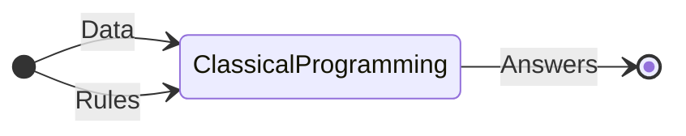
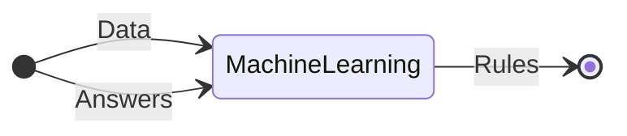

#notes 

Machine learning arose from a simple question:

>Can a computer **learn** on its own in order to perform a specified task, rather than relying on a programmer explicitly setting up the rules for it?

+ Rules rely on human understanding and manually coding.
+ This approach does not always work, as there are problems not possible to identify and explicitly write down rules.

+ Humans here provide data and the anticipated answers from it.
+ Computers output a set of rules which can then be applied to new data.

So, machines learn **mappings** from input to output: when given input data, a machine will give the *prediction* of the output for that data.
Summarily,
>**Machine Learning** is the *process* of using a training set to *learn* features, continue modelling, and finally producing an efficient model.