#notes 

We are given a set $T$ of $n$ tasks. Each task $i$ has a start time $s_{i}$ and a finish time $f_{i}$.
Every task is to be performed on a machine; every machine can only execute one task at a time. Two tasks $i,j$ can be scheduled on the same machine only if they are **non-conflicting**.
We want to schedule all tasks using the **smallest** number of machines.

```mermaid
gantt
	dateFormat ss
	axisFormat %S
	section Machine 1
		t1 : a1, 01, 3s
		t2 : a2, after a1, 4s
		t3 : after a2, 1s
	section Machine 2
		t1 : 02, 3s
		t2 : 06, 3s
	section Machine 3
		t1 : a1, 01, 3s
		t2 : after a1, 3s
```


## A Greedy Solution
```
fn task_schedule
in tasks T
op schedule
	m <- 0
	while T is not empty do
		remove task i with the smallest s_i
		if there is a free machine j for task i then
			schedule task i on machine j
		else
			m <- m + 1
			schedule task i on machine m
		endif
	endwhile
```
### Algorithm Correctness
Suppose the algorithm gives $k$ machines but there exists a better solution with at most $k-1$ machines.
Let $i$ be the first task scheduled on machine $k$. By construction of the algorithm, when we schedule task $i$, each of the machines $1,\dots,k-1$ contains all tasks that are in conflict with task $i$. All these $k-1$ tasks conflict with each other too. This is a contradiction.
### Runtime
We have $O(n\log n)$ due to the sorting of the start times $s_{1}<s_{2}<\dots<s_{n}$.
