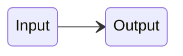
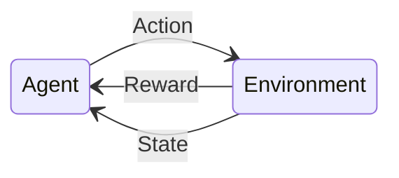

#notes 

There are 3 types of machine learning.
## Supervised Learning

Supervised learning is used to learn the mappings, or rules, between inputs and outputs.
**Labelled** data, or data with provided correct answers is provided of past input/output pairs during the learning process to train the model on how to behave when given previously unseen data.
## Unsupervised Learning
![[Unsupervised Learning.png]]
Unsupervised learning is used to learn hidden patterns from a set of inputs without outputs.
**Unlabelled** data is provided of past input *without* an output pair during the learning process.
Examples in the same group are more similar to each other than to those in different groups.
## Reinforcement Learning

In reinforcement learning, occasional positive/negative feedback is given to reinforce desired behaviours. Good behaviours are more rewarded with treat and so become more common, and vice versa. The algorithm uses a balance between exploration of new ideas and exploitation of its current knowledge.
